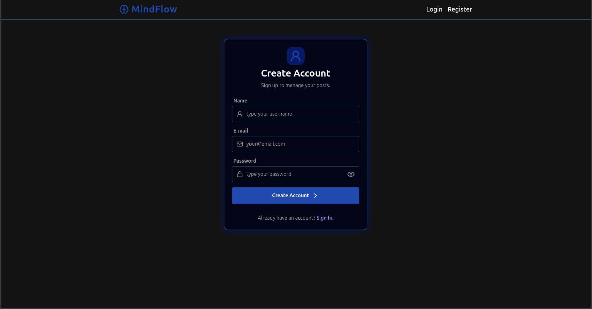
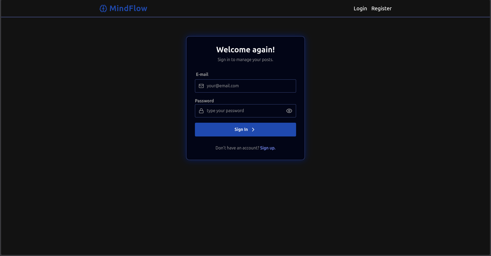
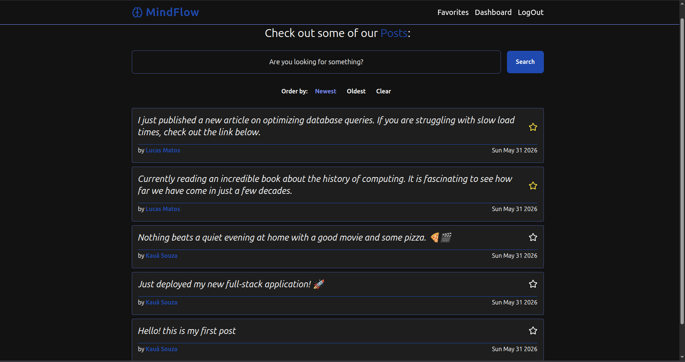
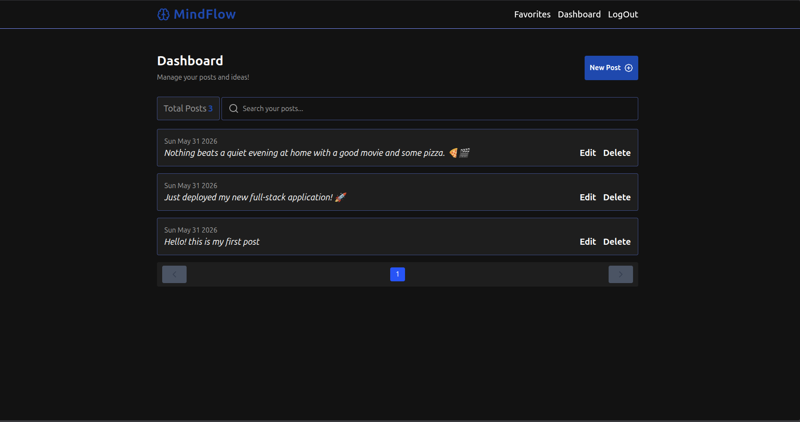
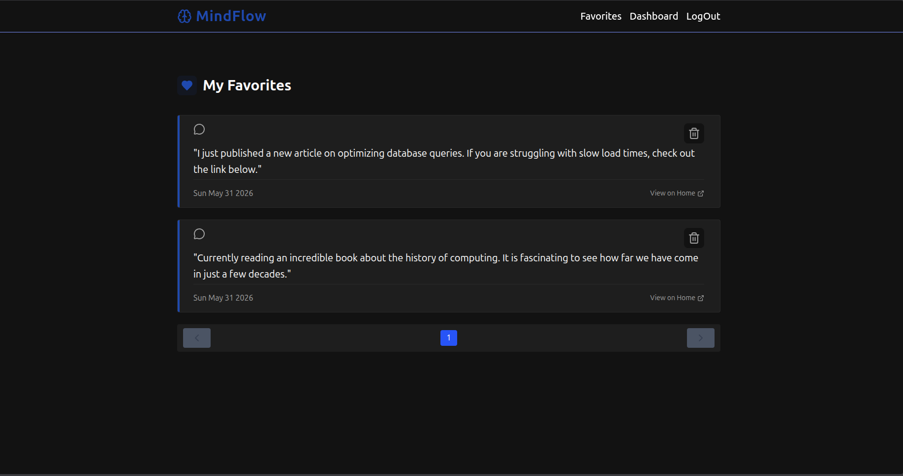

# 🧠 MindFlow


## 💻 About the Project

**MindFlow** is a _Full Stack_ web application developed for the structured management of thoughts, publications, and ideas. Built with a focus on **Clean Architecture** and **S.O.L.I.D.** principles, the project ensures a clear separation of concerns. This facilitates scalability, code maintenance, and the rigorous implementation of automated tests.

The user interface is Server-Side Rendered (SSR) using the Express Handlebars _template_ engine and styled with the Tailwind CSS, providing a fast, dynamic, and responsive user experience.

## ✨ Features

- 🔐 **Authentication and Registration** — Secure, session-based login system using `Argon2` password hashing.
- 💾 **Persistent Sessions** — Session management and storage in PostgreSQL via `connect-pg-simple`.
- 📝 **Post Management (CRUD)** — Creation, reading, updating, and deletion of publications on the user's _dashboard_.
- ⭐ **Favorites System** — Ability to save publications for quick access.
- 🔒 **CSRF Protection** — Built-in defense against Cross-Site Request Forgery.
- 🎨 **Responsive Interface (UI)** — Modern and adaptable layout, built and styled with Tailwind CSS v4.
- ✅ **Form Validation** — Rigorous data input validation and static typing using Zod.

### 🏗️ Applied Design Patterns:

- **Use Cases (Interactors):** All business logic flows are isolated into atomic and testable Use Cases within the Application layer.
- **Adapter Pattern:** Isolation of external libraries, such as data validation (**Zod**) and hashing algorithms (**Argon2**), ensuring that the business logic does not depend on third-party frameworks.
- **Repository Pattern:** Complete abstraction of database logic, facilitating provider switching and the creation of mocks (Harness) for testing.
- **Factory Pattern:** Clean and centralized dependency injection to instantiate Controllers, Use Cases, and Repositories.

---

## 🛠️ Technologies Used

### Backend

| Technology                                        | Purpose             |
| ------------------------------------------------- | ------------------- |
| [Node.js](https://nodejs.org/)                    | Runtime environment |
| [Express 5](https://expressjs.com/)               | Web framework       |
| [TypeScript](https://www.typescriptlang.org/)     | Static typing       |
| [Drizzle ORM](https://orm.drizzle.team/)          | Database ORM        |
| [PostgreSQL](https://www.postgresql.org/)         | Relational database |
| [Zod](https://zod.dev/)                           | Schema validation   |
| [Argon2](https://github.com/ranisalt/node-argon2) | Password hashing    |

### Frontend

| Technology                                  | Purpose                |
| ------------------------------------------- | ---------------------- |
| [Handlebars](https://handlebarsjs.com/)     | Server-side templating |
| [Tailwind CSS v4](https://tailwindcss.com/) | Utility-first CSS      |

### Testing

| Technology                                      | Purpose                    |
| ----------------------------------------------- | -------------------------- |
| [Vitest](https://vitest.dev/)                   | Unit and integration tests |
| [Supertest](https://github.com/ladjs/supertest) | HTTP integration tests     |
| [Playwright](https://playwright.dev/)           | End-to-end tests           |

### Tooling

| Technology                                                       | Purpose                     |
| ---------------------------------------------------------------- | --------------------------- |
| [Docker Compose](https://docs.docker.com/compose/)               | Local database containers   |
| [ESLint](https://eslint.org/) + [Prettier](https://prettier.io/) | Linting and formatting      |
| [tsup](https://tsup.egoist.dev/)                                 | Build bundler               |
| [tsx](https://tsx.is/)                                           | TypeScript execution in dev |

---

# 🚀 How to Install

### Prerequisites

- [Node.js](https://nodejs.org/) v18+
- [Docker](https://www.docker.com/) and Docker Compose
- [npm](https://www.npmjs.com/)

### 1. Clone the repository

```bash
git clone https://github.com/Kaua26323/MindFlow.git
cd MindFlow
```

### 2. Install dependencies

```bash
npm install
```

### 3. Configure environment variables

```bash
cp .env.example .env.development
```

Check the src/env/configs.ts file for more details on how we handle environments

### 4. Start the database

```bash
npm run docker:dev
```

### 5. Run migrations

```bash
npm run drizzle:migrate:dev
```

### 6. Start the application

```bash
# Start the server (with hot reload)
npm run dev

# In a separate terminal, compile CSS in watch mode
npm run dev:css
```

The application will be available at `http://localhost:3000` (or the port defined in your `.env`).

---

# 🧪 Quality and Testing

The project has three layers of testing:

### Unit tests

```bash
npm run test:unit
```

### Integration tests

```bash
# Start the test database first
npm run docker:test
npm run drizzle:migrate:dev

npm run test:int
```

### End-to-end tests (Playwright)

```bash
# Run in headless mode
npm run test:e2e

# Run in headed mode (visible browser)
npm run test:e2e:headed

# Run with Playwright UI
npm run test:e2e:ui

# Debug mode
npm run test:e2e:debug
```

### Run all tests

```bash
npm test
```

---

# 📂 Project Structure

The project adopts **Clean Architecture** principles.

```text
src/
├── application/           # APPLICATION LAYER (Pure Business Rules)
│   ├── ports/             # Abstraction contracts for external tools (e.g., hash.port.ts, validator.port.ts)
│   ├── repositories/      # Abstract persistence interfaces (e.g., user.repository.ts, post.repository.ts)
│   └── useCases/          # Implementation of system Use Cases, containing isolated application logic
│       ├── favorites/     # Favorites use cases (e.g., add-post.use-case.ts, remove-post.use-case.ts)
│       ├── posts/         # Posts use cases (e.g., create-post.use-case.ts, update-post.use-case.ts)
│       └── users/         # Users use cases (e.g., create-user.use-case.ts, user-login.use-case.ts)
│
├── infra/                 # INFRASTRUCTURE LAYER (Technical Details and Frameworks)
│   ├── adapters/          # Concrete implementations of application Ports (e.g., argon2-hash.adapter.ts, zod-validator.adapter.ts)
│   ├── db/                # Data persistence subsystem
│   │   └── drizzle/       # Drizzle ORM configuration, relational schema definitions, and SQL migrations
│   │       ├── migrations/# Auto-generated SQL files for database version control
│   │       └── schemas/   # Relational table mapping (users, posts, favoritesPosts)
│   ├── repositories/      # Repository implementations using the database driver (drizzle-user.repository.ts)
│   ├── factories/         # Dependency injection factories coupling adapters and use cases to controllers
│   └── web/               # Specific payload validation schemas for HTTP requests via Zod
│
├── web/                   # PRESENTATION LAYER (Web Interface and Routing)
│   ├── controllers/       # HTTP Controllers that receive view inputs, invoke use cases, and return responses
│   ├── middlewares/       # Express interceptors (authentication, global error handling, flash messages management)
│   ├── public/            # Directly served static files (Tailwind compiled CSS, favicons, manifests)
│   ├── routes/            # Express route definitions and grouping (user-routes.ts, post-routes.ts, etc.)
│   └── views/             # Visual layer using Server-Side Rendering (SSR) template engine
│       ├── dashboard/     # User logged-in area screens (post creation, listing, and editing)
│       ├── errors/        # Visual error handling pages (404, 500)
│       ├── favorites/     # Interface displaying user's favorited items
│       ├── layouts/       # System's base structural HTML5 template (main.handlebars)
│       └── partials/      # Reusable components (navigationBar.handlebars and modular SVG icons)
│
├── env/                   # Fail-fast validation and static typing of environment variables using Zod schemas
└── errors/                # Abstractions and specializations of internal application errors (AppError)

```

## 📸 Screenshots







## 📄 License

This project is licensed under the [MIT License](LICENSE).
